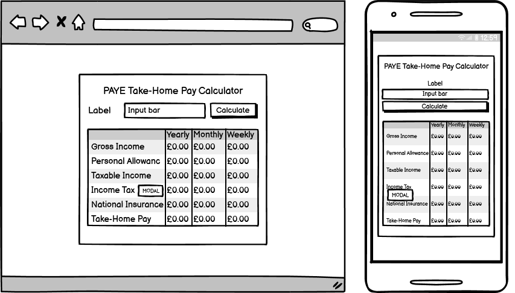

# PAYE Take-Home Pay Calculator

#### **By Jamie Harris**
[Click here to view the live web application](https://jamie-harris36.github.io/calculator/)

This is the documentation for my web application: The PAYE Take-Home Pay Calculator. It has been built using HTML5, CSS3 and JavaScript for educational purposes as part of Code Institute's Level 5 Diploma in Web Application Development course.

- - -
## Table of Contents

1. [Project Development & Planning](#project-development--planning)
    * [Project Goals](#project-goals)
    * [Research](#research)
    * [User Stories](#user-stories)
    * [Content](#content)
    * [Design, Layout & Structure](#design-layout--structure)
2. [Technologies Used](#technologies-used)
3. [Features](#features)
4. [JavaScript Functionality](#javascript-functionality)
5. [Testing & Bugs](#testing--bugs)
6. [Deployment](#deployment)
7. [Credits](#credits)

- - -
## Project Development & Planning
Throughout the development of this calculator, I followed the principles of User Experience (UX), which include the following 5 steps:
1. Strategy
2. Scope
3. Structure
4. Skeleton
5. Surface

I wanted to ensure the website was easy to use, responsive, accessible and intuitive as well as meeting the needs of the user.

- - -
### Project Goals

#### **Project Purpose**
A web-based calculator that allows users to input their annual salary, which will then display results on tax deductions, national insurance deductions and after tax (net) salary based on what amount the user inputs. 

I would like to stress that I am not an accountant or a tax expert, and tax laws are very complicated, because of this these results won't always be 100% accurate. 

They should be taken as rough estimations of take-home pay for entertainment and educational purposes, and not fully relied on to the exact amount. With that being said, the rates and thresholds for both income tax and national insurance, as well as the personal allowance, are accuarate as of the financial year of 2024/25.

#### **Client Goals**
This calculator was built as my second milestone project on my Level 5 Diploma in Web Application Development [Code Institute](https://codeinstitute.net/) as part of my interactive frontend development modules, and my first project where use of JavaScript is essential. Because of this, I didn't have a specific client.

However, to practice making my projects look professional, I treated this as a real-world application which could be used by banks or other financial institutes. This clients goals would be:
* Engaging users with interactivity and providing them with a rough estimate on the users tax deductions and take-home pay.
* Helping users to know if their income requires them to pay tax, and if so, roughly how much they will pay.
* Helping users to see yearly, monthly and weekly values, depending on how frequently they are paid.

#### **User Goals**
The audience for this calculator would be people who are employed on a PAYE (Pay as you earn) basis, and would like to estimate how much they would be paid without having to dig out their payslips or P60. The audience would also extend to people who are just curious how much their take-home pay would be if they were to start work at a particular job where the yearly salary is displayed on a job description.
User Goals:
* Showing the user a rough estimate on what their take-home pay would be based on a yearly salary they input.
* Showing the user how much of their gross (pre-taxed) income is paid in tax.
* Showing the user which tax bands they pay into (20%, 40% and 45%) and how much is paid in each tax band.
* Showing the user how much of their gross income is paid towards National Insurance contributions.

- - -
### Research
I looked at a variety of online take-home pay calculators. I looked at the style and content of the style and content of their calculators, and also how the results were presented. 

I also compared the results between each of these calculators that's displayed when I input an annual salary. I'm aware that all of these calculators are rough estimates because of how complicated the tax system can be, it would be difficult for the results to be 100% accurate. With that being said, the websites I researched are listed below.

#### **The Salary Calculator**
I really liked the layout of this calculator. I decided to simplify things though. This calculator let the user add certain options, such as inputting their own individual tax code, bonuses, pension contributions, salary sacrifice and more. 

However I wanted the user to feel like they were using a much simpler calulation, where they'd just insert their annual salary and they'd get a rough but fairly accurate estimation on what their take-home salary would be. I also wanted the calculator to be simple enough to be displayed on the entire viewport without the user having to scroll down the page.

I also liked whenever I click on the 'Tax breakdown' link, a modal shows up with the yearly, monthly and weekly breakdowns of the amounts paid within the relevant tax bands, and I wanted to incorporate this into my project too.

Here is a link to [The Salary Calculator](https://www.thesalarycalculator.co.uk/salary.php).

#### **Gov.uk Income Tax Calculator**
I like the layout of this calculator as well, especially when the results are displayed. I like how the amounts paid within the relevant tax bands are displayed without having to click on a link to display a modal. I preferred the layout of the Salary calculator though, so I based a lot of my design on that layout.

Here is a link to the [Gov.uk Income Tax Calculator](https://www.tax.service.gov.uk/estimate-paye-take-home-pay/your-pay).

#### **HMRC Income Tax and National Insurance Rates**
I researched the current income tax and national insurance rates, personal allowance and individual tax bands, to ensure the results are as accurate as possible. However I simplified the national insurance deductions, to assume that the user is being deducted class 1 contributions.

Here are links to both [Income Tax Rates & Personal Allowances](https://www.gov.uk/income-tax-rates) and [National Insurance Rates](https://www.gov.uk/national-insurance/how-much-you-pay).

#### **Research of Peoples Salaries**
I didn't want to be rude and ask for the salaries of my loved ones, but I did ask my partner, and my dad to use my calculator and tell me if their monthly take-home salary is close to the results that showed up. I did this so I knew whether my calculator was at least on the right track or not in terms of accuracy. I was satisfied to learn the results of the calculator closely matched their actual take-home salaries, although they will have other variables such as pension contributions, which I have omitted from my calculator as this is an optional deduction and the employee can opt out of pension contributions.

- - -
### Content
The calculator is made up of an input bar, where a user can input a numerical amount (above 0), there is also a 'submit' button. When a valid number is submitted, a table will appear underneath the input bar and button, displaying yearly, monthly and weekly results of the following values:
* Gross Salary
* Personal Allowance
* Taxable Income
* Income Tax Deductions
* National Insurance Deductions
* Take-Home Salary

If the income tax amount is greater than 0, then a 'Tax Breakdown' link will appear, which will prompt a pop-up modal to appear, displaying the amount of tax that is paid under each tax bracket.

As I've said previously, because of how complicated tax brackets are, and peoples taxes are calculated differently depending on their own circumstances, this information shouldn't be totally relied on and should only be used for entertainment purposes. Any queries on your tax deductions should be taken up with your company's payroll department or a qualified accountant.

- - -
### Design, Layout & Structure

#### **Wireframes**
I decided to create some wireframes with Balsamiq in order to design my site, developing the structure, skeleton and layout as well as the style and appearance of the website. I created wireframes for desktop and mobile, to ensure that responsiveness was a top priority throughout the development.

Main Wireframe

Results Wireframe

Modal Wireframe

- - -
#### **Structure**
This website has a simple structure, and (apart from the 404 page) is all contained on a single web page (index.html).

There is a container div in the centre of the screen when the page loads, and this div merely contains:
* Main heading, that says "PAYE Take-Home Pay Calculator".
* A number input bar, with an accompanying label, that says "Annual Gross Salary (£)".
* A submit button, with inner text that says "Calculate".

When the user inserts a valid annual salary (AKA a number abover 0) and clicks calculate, the div will expand to contain:
* Everything that was there before, heading, input bar with label, and submit button.
* A table, displaying results and data based on the amount the user inputs. (The results are generated with JavaScript)
* If tax is above £0.00, a link to display a modal, with the anchor text of 'BREAKDOWN' will display beside the 'Income Tax' heading.
* The modal will display yearly, monthly and weekly values of money taxed within the 20% tax bracket, and if relevant, also within the 40% and 45% tax brackets. If nothing is taxed at 40% and 45%, then these rows won't show up. 

There is also a 404 page for when a user lands on a page that doesn't exist, or types in the URL incorrectly, which contains a button that will direct the user back to the home page.

- - -
#### **Colour & Design**
I didn't really use a colour scheme as such, because I intended the design to be quite bland, I've only used basic colours. With the exception of the two blue colours for the submit button, and the colour for the table heading cells, I've only used black and white.

With that being said, here are the colours I mainly used throughout the project

- - -
#### **Fonts**
Within my font family, I used the following fonts.
* Segoe UI (Main font)
* Tahoma (backup)
* Geneva (backup)
* Verdana (backup)
* sans-serif (backup)

I felt these fonts would give a professional look which I believe to be fitting to the theme of a financial app. I didn't believe using a fun and exciting looking font would be suitable for an app such as this one.

- - -
## Technologies Used

### Languages

- - -
### Tools

- - -
## Features

### Calculator Section

#### Input Section

#### Calculate Button

### Results Section

#### Tax Breakdown Modal

- - -
### 404 Page

- - -
## JavaScript Functionality

### Calculate Take-Home Pay using mathematics and formulae

### Display Results Table

### Format results into GBP (£) currency

### Display Link To Tax Breakdown

### Display Tax Breakdown Modal

- - -
## Testing & Bugs

- - -
## Deployment

### Github Pages

The site was deployed to GitHub pages. The steps to deploy are as follows:
1. In the GitHub repository, navigate to the 'Settings' tab.
2. From the left hand menu, select 'Pages'.
3. From the source, select 'Branch: main'.
4. Click 'Save'.
5. A live link will be displayed when published successfully.

The live link can be found here - [https://jamie-harris36.github.io/calculator/](https://jamie-harris36.github.io/calculator/)

### Forking the Github Repository

You can fork the repository by following these steps:
1. Go to the GitHub repository
2. Click on Fork button in upper right hand corner

### Cloning the GitHub Repository

You can clone the repository to use locally by following these steps:
1. Navigate to the GitHub Repository you want to close
2. Click on the code drop down button
3. Click on HTTPS
4. Copy the repository link to the clipboard
5. Open your IDE of choice (git mustbe installed for the next steps)
6. Type git clone copied-git-url into the IDE terminal

The project will now be cloned locally for you to use.

- - -
## Credits

### Code

- - -
### Media

* [Background Image by StaticFlickr.com](https://live.staticflickr.com/5293/5537894072_c4e46bfce1_b.jpg)

- - -
### Acknowledgements

* My mentor [Gareth McGirr](https://github.com/Gareth-McGirr/) for all his help and guidance throughout this project.
* The team at [Code Institute](https://codeinstitute.net/) for their teaching and support.
* Komal Karir from Westminster Adult Education Service, for his help and guidance during our weekly meetings.

- - -
- - -

[Go to Top](#paye-take-home-pay-calculator)