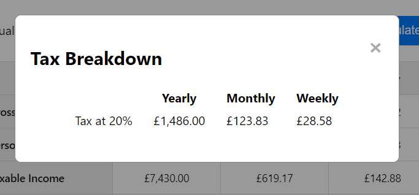
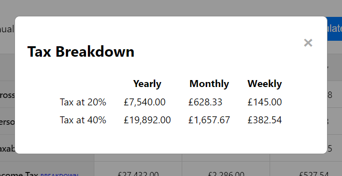

# PAYE Take-Home Pay Calculator

#### **By Jamie Harris**
[Click here to view the live web application](https://jamie-harris36.github.io/calculator/)

This is the documentation for my web application: The PAYE Take-Home Pay Calculator. It has been built using HTML5, CSS3 and JavaScript for educational purposes as part of Code Institute's Level 5 Diploma in Web Application Development course.

- - -
## Table of Contents

1. [Project Development & Planning](#project-development--planning)
    * [Project Goals](#project-goals)
    * [Research](#research)
    * [User Stories](#user-stories)
    * [Content](#content)
    * [Design, Layout & Structure](#design-layout--structure)
2. [Technologies Used](#technologies-used)
3. [Features](#features)
4. [JavaScript Functionality](#javascript-functionality)
5. [Testing & Bugs](#testing--bugs)
6. [Deployment](#deployment)
7. [Credits](#credits)

- - -
## Project Development & Planning
Throughout the development of this calculator, I followed the principles of User Experience (UX), which include the following 5 steps:
1. Strategy
2. Scope
3. Structure
4. Skeleton
5. Surface

I wanted to ensure the website was easy to use, responsive, accessible and intuitive as well as meeting the needs of the user.

- - -
### Project Goals

#### **Project Purpose**
A web-based calculator that allows users to input their annual salary, which will then display results on tax deductions, national insurance deductions and after tax (net) salary based on what amount the user inputs. 

I would like to stress that I am not an accountant or a tax expert, and tax laws are very complicated, because of this these results won't always be 100% accurate. 

They should be taken as rough estimations of take-home pay for entertainment and educational purposes, and not fully relied on to the exact amount. With that being said, the rates and thresholds for both income tax and national insurance, as well as the personal allowance, are accuarate as of the financial year of 2024/25.

#### **Client Goals**
This calculator was built as my second milestone project on my Level 5 Diploma in Web Application Development [Code Institute](https://codeinstitute.net/) as part of my interactive frontend development modules, and my first project where use of JavaScript is essential. Because of this, I didn't have a specific client.

However, to practice making my projects look professional, I treated this as a real-world application which could be used by banks or other financial institutes. This clients goals would be:
* Engaging users with interactivity and providing them with a rough estimate on the users tax deductions and take-home pay.
* Helping users to know if their income requires them to pay tax, and if so, roughly how much they will pay.
* Helping users to see yearly, monthly and weekly values, depending on how frequently they are paid.

#### **User Goals**
The audience for this calculator would be people who are employed on a PAYE (Pay as you earn) basis, and would like to estimate how much they would be paid without having to dig out their payslips or P60. The audience would also extend to people who are just curious how much their take-home pay would be if they were to start work at a particular job where the yearly salary is displayed on a job description.
User Goals:
* Showing the user a rough estimate on what their take-home pay would be based on a yearly salary they input.
* Showing the user how much of their gross (pre-taxed) income is paid in tax.
* Showing the user which tax bands they pay into (20%, 40% and 45%) and how much is paid in each tax band.
* Showing the user how much of their gross income is paid towards National Insurance contributions.

- - -
### Research
I looked at a variety of online take-home pay calculators. I looked at the style and content of the style and content of their calculators, and also how the results were presented. 

I also compared the results between each of these calculators that's displayed when I input an annual salary. I'm aware that all of these calculators are rough estimates because of how complicated the tax system can be, it would be difficult for the results to be 100% accurate. With that being said, the websites I researched are listed below.

#### **The Salary Calculator**
I really liked the layout of this calculator. I decided to simplify things though. This calculator let the user add certain options, such as inputting their own individual tax code, bonuses, pension contributions, salary sacrifice and more. 

However I wanted the user to feel like they were using a much simpler calulation, where they'd just insert their annual salary and they'd get a rough but fairly accurate estimation on what their take-home salary would be. I also wanted the calculator to be simple enough to be displayed on the entire viewport without the user having to scroll down the page.

I also liked whenever I click on the 'Tax breakdown' link, a modal shows up with the yearly, monthly and weekly breakdowns of the amounts paid within the relevant tax bands, and I wanted to incorporate this into my project too.

Here is a link to [The Salary Calculator](https://www.thesalarycalculator.co.uk/salary.php).

#### **Gov.uk Income Tax Calculator**
I like the layout of this calculator as well, especially when the results are displayed. I like how the amounts paid within the relevant tax bands are displayed without having to click on a link to display a modal. I preferred the layout of the Salary calculator though, so I based a lot of my design on that layout.

Here is a link to the [Gov.uk Income Tax Calculator](https://www.tax.service.gov.uk/estimate-paye-take-home-pay/your-pay).

#### **HMRC Income Tax and National Insurance Rates**
I researched the current income tax and national insurance rates, personal allowance and individual tax bands, to ensure the results are as accurate as possible. However I simplified the national insurance deductions, to assume that the user is being deducted class 1 contributions.

Here are links to both [Income Tax Rates & Personal Allowances](https://www.gov.uk/income-tax-rates) and [National Insurance Rates](https://www.gov.uk/national-insurance/how-much-you-pay).

#### **Research of Peoples Salaries**
I didn't want to be rude and ask for the salaries of my loved ones, but I did ask my partner, and my dad to use my calculator and tell me if their monthly take-home salary is close to the results that showed up. I did this so I knew whether my calculator was at least on the right track or not in terms of accuracy. I was satisfied to learn the results of the calculator closely matched their actual take-home salaries, although they will have other variables such as pension contributions, which I have omitted from my calculator as this is an optional deduction and the employee can opt out of pension contributions.

- - -
### Content
The calculator is made up of an input bar, where a user can input a numerical amount (above 0), there is also a 'submit' button. When a valid number is submitted, a table will appear underneath the input bar and button, displaying yearly, monthly and weekly results of the following values:
* Gross Salary
* Personal Allowance
* Taxable Income
* Income Tax Deductions
* National Insurance Deductions
* Take-Home Salary

If the income tax amount is greater than 0, then a 'Tax Breakdown' link will appear, which will prompt a pop-up modal to appear, displaying the amount of tax that is paid under each tax bracket.

As I've said previously, because of how complicated tax brackets are, and peoples taxes are calculated differently depending on their own circumstances, this information shouldn't be totally relied on and should only be used for entertainment purposes. Any queries on your tax deductions should be taken up with your company's payroll department or a qualified accountant.

- - -
### Design, Layout & Structure

#### **Wireframes**
I decided to create some wireframes with Balsamiq in order to design my site, developing the structure, skeleton and layout as well as the style and appearance of the website. I created wireframes for desktop and mobile, to ensure that responsiveness was a top priority throughout the development.

Main Wireframe

Results Wireframe

Modal Wireframe

- - -
#### **Structure**
This website has a simple structure, and (apart from the 404 page) is all contained on a single web page (index.html).

There is a container div in the centre of the screen when the page loads, and this div merely contains:
* Main heading, that says "PAYE Take-Home Pay Calculator".
* A number input bar, with an accompanying label, that says "Annual Gross Salary (£)".
* A submit button, with inner text that says "Calculate".

When the user inserts a valid annual salary (AKA a number abover 0) and clicks calculate, the div will expand to contain:
* Everything that was there before, heading, input bar with label, and submit button.
* A table, displaying results and data based on the amount the user inputs. (The results are generated with JavaScript)
* If tax is above £0.00, a link to display a modal, with the anchor text of 'BREAKDOWN' will display beside the 'Income Tax' heading.
* The modal will display yearly, monthly and weekly values of money taxed within the 20% tax bracket, and if relevant, also within the 40% and 45% tax brackets. If nothing is taxed at 40% and 45%, then these rows won't show up. 

There is also a 404 page for when a user lands on a page that doesn't exist, or types in the URL incorrectly, which contains a button that will direct the user back to the home page.

- - -
#### **Colour & Design**
I didn't really use a colour scheme as such, because I intended the design to be quite bland, I've only used basic colours. With the exception of the two blue colours for the submit button, and the colour for the table heading cells, I've only used black and white.

With that being said, here are the colours I mainly used throughout the project:

- - -
#### **Fonts**
Within my font family, I used the following fonts.
* Segoe UI (Main font)
* Tahoma (backup)
* Geneva (backup)
* Verdana (backup)
* sans-serif (backup)

I felt these fonts would give a professional look which I believe to be fitting to the theme of a financial app. I didn't believe using a fun and exciting looking font would be suitable for an app such as this one.

- - -
## Technologies Used

### Languages
* [HTML5](https://en.wikipedia.org/wiki/HTML5)
* [CSS3](https://en.wikipedia.org/wiki/Cascading_Style_Sheets)
* [JavaScript](https://en.wikipedia.org/wiki/JavaScript)

- - -
### Tools
* [Git](https://git-scm.com/)
    * Used for version control via Visual Studio Code by using the terminal to Push to GitHub.
* [GitHub](https://github.com/)
    * Used to store the project code after being created in Visual Studio Code and Pushed via Git.
* [Visual Studio Code](https://code.visualstudio.com/)
    * Used to create, edit and preview the projects code.
* [Balsamiq](https://balsamiq.com/)
    * Used to build and develop the wireframes.
* [Canva](https://www.canva.com/)
    * Used to design the colour palette image.
* [Am I Responsive?](https://ui.dev/amiresponsive)
    * Used to create the website mockup image.
* [Remove BG](remove.bg)
    * Used to add a transparent background to the mockup image.

- - -
## Features

### Calculator Section

Screenshots

*Home Page*

*Calculator section, containing the input bar, label and submit button*

*Error alert, when 0 or negative number is input*

* Layout is responsive, with margins and font sizes changing on smaller screens.
* Salary input box
    * User must enter a valid input to launch the calculator - alert will appear if no number, or amounts of 0 and under are entered.
    * Users salary is displayed in the results, which will personalise the results.
* Calculate Button - launches the calculator and displays the results
    * Has a hover effect on non-touchscreen devices, with a smooth colour transition.

- - -
### Results Section

Screenshots

*Main results table*

*Results table with £32,000 salary input*

*Close up of tax breakdown link, which is on displayed as tax is over £0.00*

*Results table with £10,000 salary input*

*Close up of tax breakdown link that's hidden as tax is at £0.00*

*Results table of £150,000 salary input*

*Close up of personal allowance, reduced to £0.00. Personal allowance is reduced on incomes over £100,000*

* When the data is input and the results table appears, this section gives yearly, monthly and weekly information about the following:
    * Users gross salary (the yearly value will be what the user input into the calculator)
    * Personal allowance
    * Taxable income
    * Income tax deductions (this is where the 'tax-breakdown' link will appear)
    * National insurance deductions
    * Take-home salary
* The orignal calculator (input, label and button) still appears, so the user can insert another amount and get different results.
* If tax is above 0, the aforementioned tax breakdown link will appear, prompting a tax breakdown modal to appear.

- - -
### Tax Breakdown Modal

Screenshots

*Tax Breakdown modal, with 20% tax bracket displayed on income over £12,570. 40% and 45% amounts aren't shown as nothing is taxed at 40% or 45% here*

*Tax Breakdown modal, with 20% and 40% tax brackets displayed, on income over £50,270. 45% amount isn't shown as nothing is taxed at 45% here*

*Tax Breakdown modal, with 20%, 40% and 45% tax brackets displayed, on income over £125,140*

* When the tax-breakdown link appears and is clicked, a pop-up modal will appear, displaying how the tax is broken down in different tax brackets.
* Yearly, monthly and weekly values of this breakdown will be given.
* Clicking on the 'x' or outside the modal will close the modal.
* Only the relevant tax brackets will display, for example if no tax is paid at 40% and 45%, then only the 20% tax will display.s

- - -
### 404 Page

Screenshots

*Content in the 404 error page. Same background image as the main page. Link to homepage is displayed.*

* This 404 page is what the user will land on if they navigate to a non-existant part of the site, or if they incorrectly type the URL.
* This 404 page provides a positive user experience, as the standard 'GitHub Pages' 404 page doesn't match the theme of this site, and doesn't have a link to the home page, giving bad UX.
* This page has a similar design as the rest of the site, so users don't feel like they've left the site.
* There is a 'Back to Home' button, which will take the user back to the home page without use of the browsers 'back' button.

- - -
## JavaScript Functionality
This section will explain what happens in the JavaScript code as the user navigates through the calculator. There are comments in the JavaScript code that explain this too.

### Calculate Take-Home Pay using mathematics and formulae
* The user will enter their gross annual salary and then click on 'Calculate':
    * If no amount is entered prior to pressing 'Calculate', an alert will appear prompting the user to enter a valid salary.
    * If '0' or a negative number is entered prior to pressing 'Calculate', an alert will appear prompting the user to enter a valid salary.
    * If a valid amount (a number over 0) is entered, that amount will be stored to be used in the results table that will subsequently be shown.

* The 'Calculate' button will start the main JavaScript function that will calculate the take-home pay.
    * The calculator will take the salary that's been entered, and will figure out the following:
        * Gross Income: This value is simply taken from what the user has input.
        * Personal Allowance: The standard personal allowance is £12,570. This decreases on incomes of over £100,000, which is explained later.
        * Taxable Income: Taxable income is Gross salary, minus personal allowance.
        * Income Tax: Income tax is taxed as the following:
            * 20% on income between personal allowance and £50,270.
            * 40% on income between £50,271 and £125,140.
            * 45% on income over £125,140.
            * 0% on income below £12,570.
            * The total income tax is calculated by adding all of the amounts from each tax bracket together. Explained further below in the 'Income Tax Breakdown' section.
        * National Insurance: National Insurance is calculated with the following:
            * 8% on income between £12,571 and £50,270.
            * 2% on income over £50,271.
            * 0% on income below £12,570.
            * The National Insurance calculation is simplified, and assumes that the user pays Class 1 National Insurance.
        * Take-Home Pay: Calculated by taking Gross Income, and minusing Income Tax and National Insurance.
    * The calculator will also figure out these values in different frequencies:
        * Yearly: Each value will appear as is, because the user has inserted a yearly salary, yearly values are standard.
        * Monthly: The monthly values are essentially the yearly values, divided by 12.
        * Weekly: The weekly values are essentially the yearly values, divided by 52.

### Calculate Income Tax Breakdown
* Before the calculator figures out the total income tax, it will calculate the tax breakdown.
    * It will calculate how much will be taxed at 20%, how much at 40% and how much at 45%.
    * Once these values are calculated, they will be added together to calculate the total income tax.

### Format results into GBP (£) currency
* Instead of displaying the results in strictly numerical values, the calculator will display the results in GBP (£) currency, meaning the results will always be rounded to two decimal places, for example, £3 will be £3.00, and 6.3358 will be £6.34. Seeing as this is a financial application, it made the most sense for the results to display this way.

### Calculate Personal Allowance
* The personal allowance will usually be £12,570. Which means any income up to that amount is tax free.
    * Any income over this amount will be the figure that shows up as 'Taxable Income'.
    * So if income is below £12,570, then taxable income will always be £0.00, thus no tax is paid.
* On incomes above £100,000, the personal allowance will decrease by £1 with every £2 that's earned above £100,000.
    * This means that by the time income reaches £125,140, the personal allowance is completely gone, and ALL income is taxable.

### Display Results Table
* When the 'Calculate' button has been pressed by the user, a table will display within the main container div and show the yearly, monthly and weekly results that have been previously figured out by the calculator.
    * If the alert previously appeared and the user goes on to enter a valid amount, the alert will then disappear.
    * If income tax is above 0, a small link with the anchor text 'BREAKDOWN' will appear by the 'Income Tax' row heading.
    * If income tax is 0, then the breakdown link will not appear.

### Display Tax Breakdown Modal
* When the user clicks the 'Breakdown' link, a modal will appear.
* The modal will display the yearly, monthly and weekly values of income tax that is paid.
* The modal will display the relevant tax brackets which are paid. 
* If tax is only paid within the 20% tax bracket, the 40% and 45% tax bracket rows do not display, as they're not relevant and it's pointless to show that the user is paying £0.00 in the 45% tax bracket.

- - -
## Testing & Bugs

- - -
## Deployment

### Github Pages

The site was deployed to GitHub pages. The steps to deploy are as follows:
1. In the GitHub repository, navigate to the 'Settings' tab.
2. From the left hand menu, select 'Pages'.
3. From the source, select 'Branch: main'.
4. Click 'Save'.
5. A live link will be displayed when published successfully.

The live link can be found here - [https://jamie-harris36.github.io/calculator/](https://jamie-harris36.github.io/calculator/)

### Forking the Github Repository

You can fork the repository by following these steps:
1. Go to the GitHub repository
2. Click on Fork button in upper right hand corner

### Cloning the GitHub Repository

You can clone the repository to use locally by following these steps:
1. Navigate to the GitHub Repository you want to close
2. Click on the code drop down button
3. Click on HTTPS
4. Copy the repository link to the clipboard
5. Open your IDE of choice (git mustbe installed for the next steps)
6. Type git clone copied-git-url into the IDE terminal

The project will now be cloned locally for you to use.

- - -
## Credits

### Code

- - -
### Media

* [Background Image by StaticFlickr.com](https://live.staticflickr.com/5293/5537894072_c4e46bfce1_b.jpg)

- - -
### Acknowledgements

* My mentor [Gareth McGirr](https://github.com/Gareth-McGirr/) for all his help and guidance throughout this project.
* The team at [Code Institute](https://codeinstitute.net/) for their teaching and support.
* Komal Karir from Westminster Adult Education Service, for his help and guidance during our weekly meetings.

- - -
- - -

[Go to Top](#paye-take-home-pay-calculator)